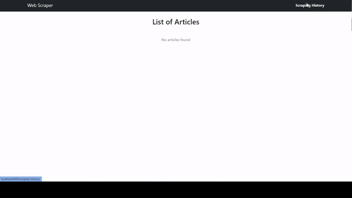

<center><h1>Web Scraper Website</h1></center>

## Table of Contents:
- [Table of Contents:](#table-of-contents)
- [GIF of what you'll see on this app](#gif-of-what-youll-see-on-this-app)
- [Installation/Development](#installationdevelopment)

## GIF of what you'll see on this app


## Installation/Development
1.  Fork this repository to your local machine.
2.  Create a .env file in the root directory.
3.  Provide environment variables to .env file (below is an example you can use):
    ```text
    SECRET_KEY=SECRET_KEY
    DEBUG=True
    DB_NAME=db
    DB_USER=user
    DB_PASSWORD=password
    DB_HOST=db
    DB_PORT=5432
    CELERY_BROKER_URL=redis://redis:6379/0
    CELERY_RESULT_BACKEND=redis://redis:6379/0
    SCRAPE_URL=https://medium.com/search?q=programming
    ```
4.  Run all containers by running:
    ```shell
    docker-compose up
    ```
5.  Django development web server will run on port 8000.
6.  You can interact with the app at this point. Happy using it!